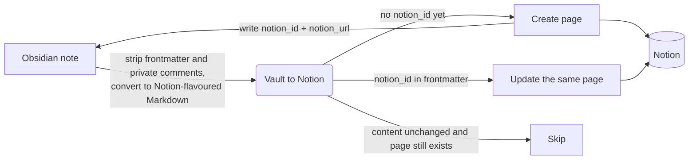
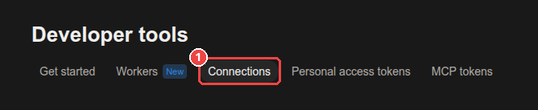
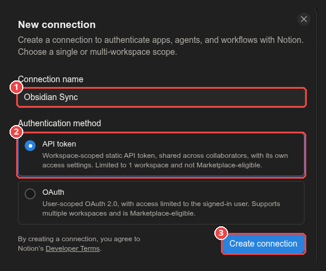
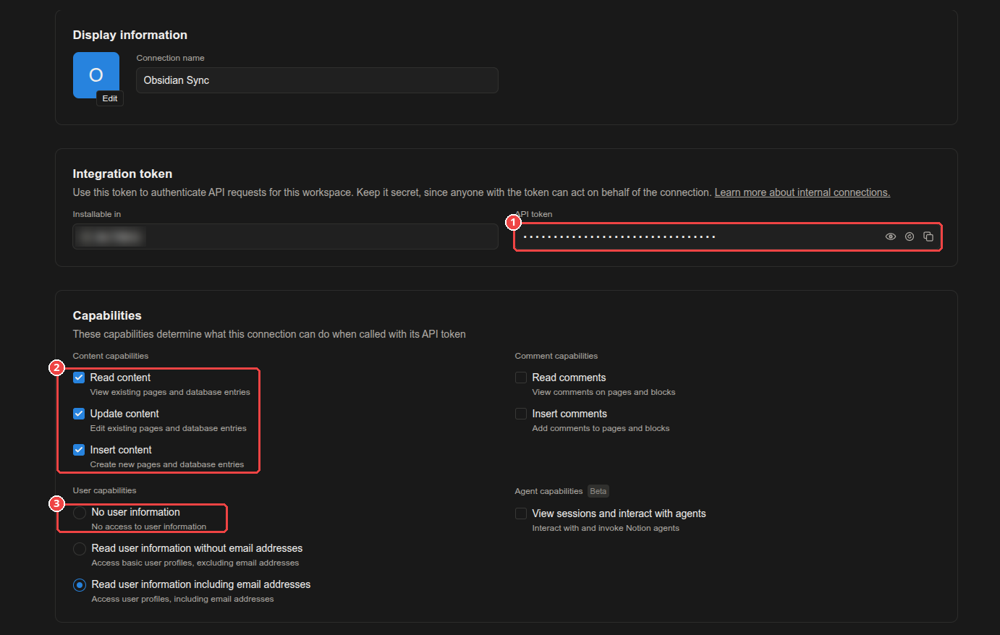
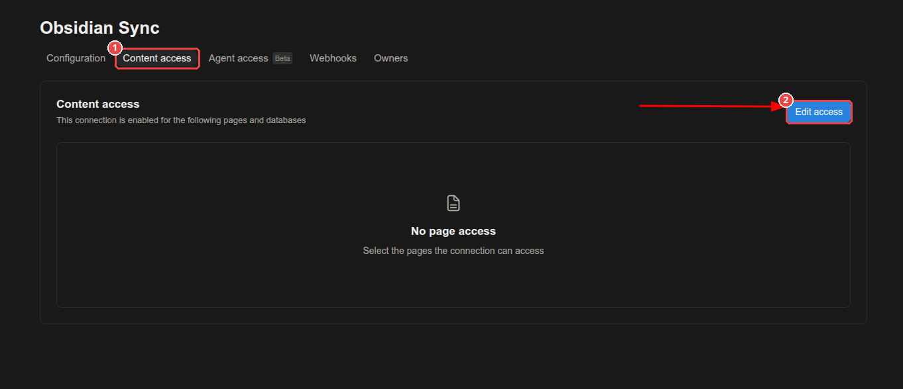
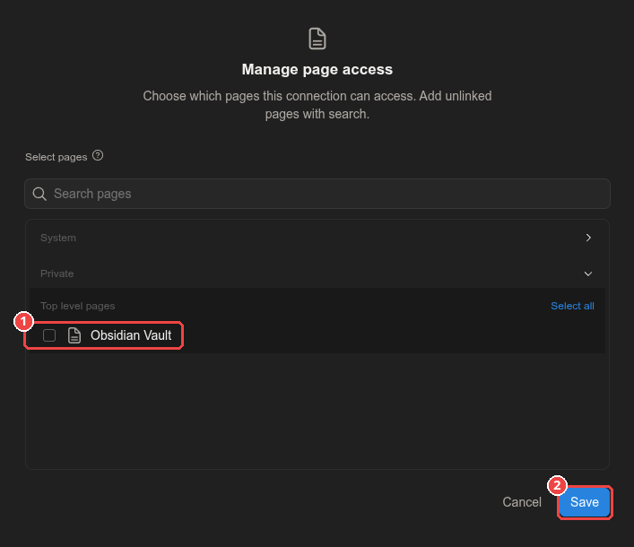
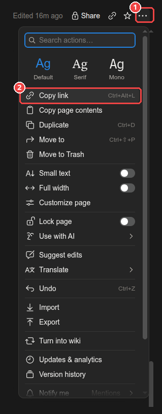
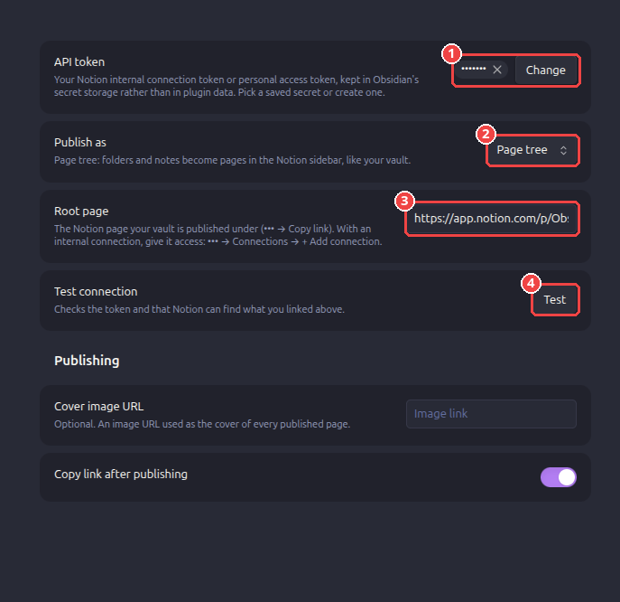
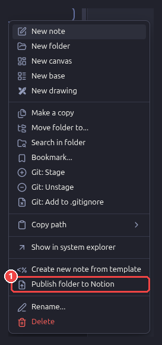

# Vault to Notion

Publish your Obsidian notes to Notion — as a page tree that mirrors your vault, or as rows of a
database — and keep them updated in place.

[](LICENSE)
[](https://developers.notion.com/reference/versioning)
[](https://obsidian.md)


**Your vault in Obsidian → the same structure in Notion** (page tree mode):

<table>
<tr><th>Obsidian vault</th><th>Notion sidebar</th></tr>
<tr><td>
<pre>
📁 Projects
   📁 Website
      📝 Launch plan
      📝 SEO checklist
   📝 Ideas
📝 Reading list
</pre>
</td><td>
<pre>
📄 Obsidian Vault
   📁 Projects
      📁 Website
         📄 Launch plan
         📄 SEO checklist
      📄 Ideas
   📄 Reading list
</pre>
</td></tr>
</table>

## Contents

- [Features](#features)
- [How it works](#how-it-works)
- [Requirements](#requirements)
- [Installation](#installation)
- [Configuration](#configuration)
  - [1. Create a Notion API token](#1-create-a-notion-api-token)
  - [2. Prepare the destination in Notion](#2-prepare-the-destination-in-notion)
  - [3. Give your connection access](#3-give-your-connection-access)
  - [4. Configure the plugin](#4-configure-the-plugin)
  - [Settings reference](#settings-reference)
- [Usage](#usage)
- [What happens when…](#what-happens-when)
- [Markdown conversion](#markdown-conversion)
- [Troubleshooting](#troubleshooting)
- [Limitations](#limitations)
- [Network use and privacy](#network-use-and-privacy)
- [Development](#development)
- [License](#license)

## Features

- **Two publishing modes**
  - **Page tree** *(default)* — folders and notes become pages in the Notion sidebar, exactly
    like your vault. Needs a single Notion page link.
  - **Database** — notes become rows of a Notion database with optional `Tags` and `Folder`
    columns for filtering, sorting and grouping; optionally also a folder tree in which every
    folder page shows a filtered table of its notes.
- **Updates in place.** Publishing again updates the same Notion page, so its link and
  comments survive. A note moved to another folder has its page moved too (page tree mode).
- **Whole-folder publishing.** Right-click any folder. Unchanged notes are skipped without
  re-uploading, and pages deleted in Notion are recreated.
- **Obsidian-aware conversion** to Notion's own Markdown format: callouts, highlights, task
  lists, tables, code, math — while `%% comments %%` stay private.
- **Built on Notion's current API** (`2026-03-11`): the markdown content API, data sources,
  views and page moves, with rate-limit handling as Notion recommends.
- Works on **desktop and mobile**, from the ribbon, the command palette or the file
  explorer's context menu.

## How it works



The plugin talks to the [Notion REST API](https://developers.notion.com/reference/intro)
directly from Obsidian. Note content is sent with Notion's
[markdown content API](https://developers.notion.com/guides/data-apis/working-with-markdown-content)
in [Notion-flavoured Markdown](https://developers.notion.com/guides/data-apis/enhanced-markdown).
Which page belongs to which note is stored in the note itself (`notion_id` in the
frontmatter), so it travels with the note across devices.

## Requirements

- Obsidian **1.11.4** or later (desktop or mobile) — the first version with secret storage.
- A Notion account, and a Notion **API token** — see [step 1](#1-create-a-notion-api-token).

## Installation

**From Obsidian** *(once listed in the community directory)*: **Settings → Community plugins →
Browse**, search for **Vault to Notion**, then **Install** and **Enable**.

**With BRAT** (beta versions): install the
[BRAT](https://github.com/TfTHacker/obsidian42-brat) plugin, choose **Add beta plugin**, and
enter this repository's URL.

**Manually**: download `main.js` and `manifest.json` from the
[latest release](../../releases/latest) into `<your vault>/.obsidian/plugins/vault-to-notion/`,
reload Obsidian, and enable **Vault to Notion** under **Settings → Community plugins**.

## Configuration

Setup takes about five minutes. You only do it once per vault.

### 1. Create a Notion API token

Notion offers two kinds of tokens that work with this plugin. Both start with `ntn_`.

| | Internal connection *(recommended)* | Personal access token |
| --- | --- | --- |
| Acts as | Its own bot user | You |
| Can reach | Only pages you share with it | Every page you can open |
| Sharing step | Required ([step 3](#3-give-your-connection-access)) | Not needed |
| Where to create it | Developer portal → **Connections** | Developer portal → **Personal access tokens** |
| Who can create it | Workspace owners | Any member *(Business/Enterprise: if an owner allows it)* |
| Free workspace with several members | Limited to 1,000 lifetime blocks ([details](#troubleshooting)) | Not limited |
| Official guide | [Internal connections](https://developers.notion.com/guides/get-started/internal-connections) | [Personal access tokens](https://developers.notion.com/guides/get-started/personal-access-tokens) |

The internal connection is recommended because it can only see what you explicitly share with
it — the least access the plugin needs.

**Create an internal connection**

1. Open the [Developer portal](https://app.notion.com/developers/connections) and select
   the **Connections** tab ①.

   

2. Create a new connection: enter a **Connection name** such as *Obsidian Sync* ①, keep
   **API token** as the authentication method ②, and click **Create connection** ③.
   *OAuth* is meant for apps used by other people's workspaces and is not needed here.

   

3. On the connection's **Configuration** tab:
   - ① Copy the **API token** under *Integration token* with the copy button. Keep it secret:
     anyone with the token can act on behalf of the connection.
   - ② Under *Content capabilities*, keep **Read content**, **Update content** and
     **Insert content** checked.
   - ③ Under *User capabilities*, choose **No user information** — the plugin never reads
     user data, so it is best not to grant it.

   

   Why each capability is needed (see Notion's
   [capabilities reference](https://developers.notion.com/reference/capabilities)):

   | Capability | Used to |
   | --- | --- |
   | Read content | Check that pages exist and read the database's columns |
   | Update content | Update published pages and move them between folders |
   | Insert content | Create pages, folder pages and folder tables |

**Or create a personal access token**: in the same Developer portal, select the
**Personal access tokens** tab, click **New token**, give it a name, select the **Notion API**
capability, and create it. Copy the token right away — it is shown only once
([guide](https://developers.notion.com/guides/get-started/personal-access-tokens)).

### 2. Prepare the destination in Notion

<details open>
<summary><b>Page tree</b> (default)</summary>

Create an ordinary page that will hold your vault, for example **Obsidian Vault**. The plugin
creates one page per folder and one page per note underneath it.

</details>

<details>
<summary><b>Database</b></summary>

Create a database, for example by typing `/database` on a page and choosing
**Database – Full page**. The title column is detected automatically. Optionally add:

| Column | Type | Used for |
| --- | --- | --- |
| `Tags` | Multi-select | The note's frontmatter `tags` |
| `Folder` | Select (or Text) | The note's folder path, e.g. `Projects/Website` |

Column names can be changed in the settings. Options inside the columns are created
automatically.

Use the original database, not a *linked view* of it — the Notion API
[does not support linked databases](https://developers.notion.com/reference/retrieve-a-database).
Databases with several data sources are supported by pasting the data source ID instead of the
link (**•••** → **Manage data sources** → **Copy data source ID**), as described in Notion's
[data sources upgrade guide](https://developers.notion.com/docs/upgrade-guide-2025-09-03).

</details>

> **Tip:** put the database inside your "Obsidian Vault" page. Access given to a page also
> covers everything inside it, so you only share once.

### 3. Give your connection access

*Skip to "Copy the link" if you use a personal access token.*

An internal connection cannot see anything until you give it access. Access to a page also
covers everything inside it, as Notion's
[capabilities reference](https://developers.notion.com/reference/capabilities) notes, so
sharing your "Obsidian Vault" page once is enough.

**In the Developer portal** — open your connection, select the **Content access** tab ①, and
click **Edit access** ②:



Tick the page from step 2 ① and click **Save** ②:



**Or from Notion itself** — open the page, click **•••** → **Connections** → **+ Add
connection**, and choose your connection. Both ways are described in Notion's
[internal connections guide](https://developers.notion.com/guides/get-started/internal-connections#granting-page-access).

**Copy the link** — open the page (or database), click **•••** ① → **Copy link** ②, or press
<kbd>Ctrl</kbd>+<kbd>Alt</kbd>+<kbd>L</kbd>:



Links look like `https://app.notion.com/p/Obsidian-Vault-3f31…`. The plugin reads the ID from
any Notion link, including older `notion.so` links.

### 4. Configure the plugin

Open **Settings → Vault to Notion**:

1. In **API token** ①, click **Change** and create a secret holding your token (or pick one
   you saved before).
   Obsidian keeps it in its [secret storage](https://docs.obsidian.md/plugins/guides/secret-storage),
   not in the plugin's settings file, and other plugins can reuse the same secret.
2. Choose **Publish as** ②: *Page tree* or *Database*.
3. Paste the link from step 3 into **Root page** ③ (page tree) or **Database** (database).
4. Click **Test** ④. You should see *Connected to "Obsidian Vault"*. If not, the message
   explains what to fix — see also [Troubleshooting](#troubleshooting).



In *Database* mode, a **Columns** section with the tag and folder options appears below
**Test connection**.

### Settings reference

| Setting | Mode | Default | Description |
| --- | --- | --- | --- |
| API token | Both | — | The secret (in Obsidian's secret storage) that holds your internal connection token or personal access token (`ntn_…`). |
| Publish as | Both | Page tree | *Page tree*: pages in the sidebar. *Database*: rows of a database. |
| Root page | Page tree | — | The page your vault is published under. |
| Database | Database | — | Database link, or a data source ID. |
| Sync tags | Database | Off | Copy frontmatter `tags` into a multi-select column. |
| Tags column | Database | `Tags` | Name of that column. |
| Sync folder | Database | Off | Write the note's folder path into a select or text column. |
| Folder column | Database | `Folder` | Name of that column. |
| Folder pages | Database | — | Optional page under which a folder tree is built; each folder page shows a table of its notes. Requires *Sync folder*. |
| Cover image URL | Both | — | Optional image used as the cover of every published page. |
| Copy link after publishing | Both | On | Copy the page link to the clipboard after publishing one note. |

## Usage

| Action | How |
| --- | --- |
| Publish the current note | Ribbon icon, command **Vault to Notion: Publish current note**, or right-click the note → **Publish to Notion** |
| Publish a folder (and its subfolders) | Right-click the folder → **Publish folder to Notion**, or command **Vault to Notion: Publish folder…** |
| Open the note's Notion page | Command **Vault to Notion: Open current note in Notion** |

To publish a whole folder, right-click it in the file explorer and choose **Publish folder to
Notion** ①:



After the first publish, two properties are added to the note's frontmatter:

```yaml
notion_id: 1a2b3c4d-5e6f-4a1b-9c2d-3e4f5a6b7c8d
notion_url: https://app.notion.com/p/My-note-1a2b3c4d5e6f4a1b9c2d3e4f5a6b7c8d
```

`notion_id` links the note to its page — keep it to update the same page next time, or delete
it to publish a fresh copy. Publishing a folder with more than 20 notes asks for confirmation
first, and ends with a summary such as *12 created, 3 updated, 85 unchanged*.

## What happens when…

| You… | Result in Notion |
| --- | --- |
| Publish a note for the first time | A page is created. |
| Edit the note and publish again | The same page is updated; its link stays the same. |
| Publish a folder in which nothing changed | Nothing is uploaded; notes are reported as *unchanged*. |
| Move a note to another folder | Page tree: the page moves to the new folder page. Database: the `Folder` column changes. |
| Rename a note | The page title changes. |
| Rename or move a folder | A new folder page is created; delete the old one in Notion. |
| Delete a note in Obsidian | The Notion page is kept. |
| Delete or trash a page in Notion | It is recreated on the next publish. |
| Edit a published page in Notion | Your edits are overwritten the next time the note changes. Obsidian is the source of truth. |
| Add sub-pages inside a published page in Notion | The update stops instead of deleting them. |
| Duplicate a note in Obsidian | The copy shares `notion_id` with the original — remove it from the copy first, or both will write to one page. |

## Markdown conversion

Notes are converted to
[Notion-flavoured Markdown](https://developers.notion.com/guides/data-apis/enhanced-markdown)
before upload.

| In Obsidian | In Notion |
| --- | --- |
| Headings, **bold**, *italic*, ~~strike~~, `code`, links | Same |
| Nested lists (tabs or spaces) | Nested lists |
| `- [ ]` / `- [x]` tasks | To-dos (custom statuses such as `[/]` stay unchecked) |
| `> [!tip] Title` callouts | Callouts with a matching icon and colour |
| `> quote` over several lines | One quote block |
| `==highlight==`, `<mark>` | Yellow highlight |
| Tables, code blocks, `$$math$$` | Tables, code blocks, equations |
| `[[Note]]`, `[[Note\|alias]]` | Plain text (`Note`, `alias`) |
| `[text](other-note.md)` | Plain text |
| `![[image.png]]`, local images, embeds | Visible marker such as *[image: image.png]* |
| `%% comment %%`, `<!-- comment -->` | **Removed** — never sent to Notion |
| Frontmatter | Not part of the page body |
| Block IDs (`^abc123`) | Removed |

## Troubleshooting

Click **Test** in the settings first — it checks the token and the destination without
publishing anything.

| Message | Cause and fix |
| --- | --- |
| *Choose the secret that holds your Notion API token first* / *Set the Notion API token…* | No secret is selected in **API token**, or the selected secret is empty — for example on a new device, since secrets are not synced. Create or pick the secret again. |
| *Notion could not find the root page / this database… + Add connection → "Obsidian"* | The connection has no access. Share the page or database with it ([step 3](#3-give-your-connection-access)). |
| *This link is a page, not a database* | A page link was pasted in **Database**. Paste a database link, or switch **Publish as** to *Page tree*. |
| *This database has 2 data sources* | Paste the data source ID instead (**•••** → **Manage data sources** → **Copy data source ID**). |
| *The database needs a multi-select column named "Tags"* (or select column "Folder") | Add the column, rename it in the settings, or turn off *Sync tags* / *Sync folder*. |
| *Folder pages need "Sync folder" to be turned on* | Turn on *Sync folder*, or clear *Folder pages*. |
| *The root page is in the Notion trash* | Restore it from Notion's trash, or choose another page. |
| *API token is invalid* (HTTP 401) | The token was mistyped or revoked. Copy it again from the Developer portal. |
| HTTP 403 `restricted_resource` | The connection lacks a capability ([step 1](#1-create-a-notion-api-token)), or a Free workspace with more than one member reached its [1,000-block limit](https://developers.notion.com/reference/workspace-block-limits). That limit does not apply to personal access tokens. |
| *…would delete child pages or databases* | You added sub-pages inside a published page in Notion. Move them elsewhere, then publish again. |
| *…too large or too heavily formatted* | Notion accepts at most 5,000 blocks per page ([docs](https://developers.notion.com/guides/data-apis/working-with-markdown-content)). Split the note. |
| *The change may still have been saved; check Notion before trying again* | Notion timed out while writing. Check the page in Notion before publishing again. |
| Publishing is slow on large folders | Notion limits each connection to a number of requests per minute ([request limits](https://developers.notion.com/reference/request-limits)); the plugin waits and retries automatically. |

Technical details of failures are written to the developer console
(**View → Toggle Developer Tools**), prefixed with `[Vault to Notion]`.

## Limitations

- Local images, attachments and embeds are not uploaded yet.
- Links between notes become plain text rather than links between Notion pages.
- Publishing is one-way: changes made in Notion are not brought back into Obsidian.
- Deleting notes or folders in Obsidian does not delete their Notion pages.

## Network use and privacy

This plugin connects to one remote service: the **Notion API at `api.notion.com`**. It is used
to read the page or database you configure and to create, update and move pages there. The
plugin sends the content of the notes you publish — nothing else, and only when you publish.
There is no telemetry and no other server involved.

Your API token is kept in Obsidian's
[secret storage](https://docs.obsidian.md/plugins/guides/secret-storage) on this device, not in
the plugin's `data.json`, so it does not end up in vault backups, sync or Git. Secret storage is
not synced between devices: on another device, add the token once more in the settings.
Tokens saved by earlier builds in `data.json` are moved into secret storage automatically.

## Development

```bash
npm install
npm run dev     # rebuild main.js on every change
npm run build   # type-check and build for production
npm run lint    # Obsidian's official lint rules (eslint-plugin-obsidianmd)
```

Copy `main.js` and `manifest.json` into `<vault>/.obsidian/plugins/vault-to-notion/` and reload
the plugin.

| Path | Purpose |
| --- | --- |
| `src/main.ts` | Plugin entry: commands, menus, single-note and folder publishing |
| `src/publisher.ts` | Resolves the destination; creates, updates and moves pages; folder pages |
| `src/notion-api.ts` | Notion REST client: API version, retries, async tasks |
| `src/markdown.ts` | Obsidian → Notion-flavoured Markdown conversion |
| `src/settings.ts` | Settings and settings tab |

**Releasing**: run `npm version <x.y.z>` and push the tag. The GitHub workflow builds the plugin
and attaches `main.js` and `manifest.json` to a release named after the version.

## License

MIT © 2026 An Tran Solutions — see [LICENSE](LICENSE).

Inspired by [Obsidian shared to Notion](https://github.com/EasyChris/obsidian-to-notion) by EasyChris.
